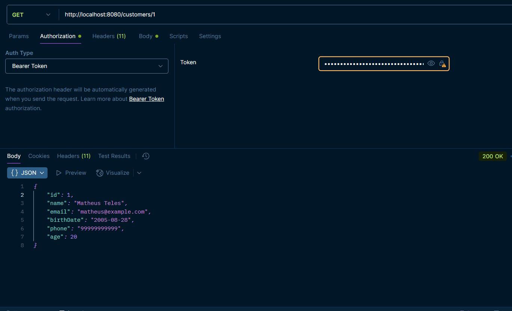

# 👥 Customer Management API

📄 **Description**  
REST API developed to manage individual customers. Through this API, it is possible to create, update, retrieve, and delete customers, as well as search by specific attributes.

---

⚙️ **Features**  

- **Customer creation:** Allows registering new customers in the system.  
- **Customer update:** Enables updating existing customer information.  
- **Customer deletion:** Allows removing customers from the system.  
- **Customer retrieval:** Paginated listing of registered customers.  
- **Attribute search:** Search customers by name, CPF, email, phone, or birth date.  
- **Security:** Endpoints are protected with Spring Security + JWT, except the creation (POST).  

---

🛠️ **Technologies**  

- **Language:** Java 21  
- **Framework:** Spring Boot (Web, JPA, Security)  
- **Dependency Manager:** Maven  
- **Database:** PostgreSQL  
- **Security:** JWT (JSON Web Tokens)  
- **Testing:** JUnit 5, Mockito, Integration Tests with MockMvc and Spring Boot Test  
- **API Documentation:** SpringDoc (Swagger/OpenAPI)  

---

📝 **Endpoints**  

- Local documentation: [http://localhost:8080/swagger-ui/index.html](http://localhost:8080/swagger-ui/index.html)  

Main endpoints:  
- `POST /customers` → Create new customer (public)  
- `GET /customers` → List customers (with pagination and filters)  
- `GET /customers/{id}` → Get customer by ID  
- `PUT /customers/{id}` → Update customer  
- `DELETE /customers/{id}` → Delete customer  
- `POST /customers/login` → Authentication (returns JWT)

🖼️ **Project Images**  

<details>
  <summary>Swagger / API Documentation</summary>
  
</details>

<details>
  <summary>Login / JWT Request</summary>
  
</details>

<details>
  <summary>GET Request with Bearer Token</summary>
  
</details>

➡️ **Application Flow**  

1. A customer is created through the public endpoint `POST /customers`.  
2. The customer logs in with their credentials (`POST /customers/login`) and receives a JWT.  
3. Using the JWT, the customer can access protected endpoints: retrieve, update, or delete customer data.  

---

⚙️ **Setup & Run**  

**Prerequisites:**  

- Java 21  
- Maven  
- PostgreSQL  

**Setup Steps:**  

1. Clone the repository  
2. Navigate to the project directory  
3. Configure the database in `src/main/resources/application.properties` (URL, username, password)  

```bash
# Run the application
mvn spring-boot:run

# Stop the application
Ctrl + C
```

🙋‍♀️ Author
👨‍💻 Project developed by Matheus T.

🤝 Feel free to contribute!
